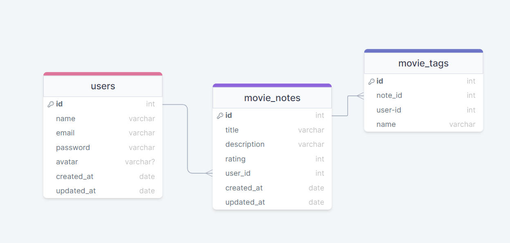
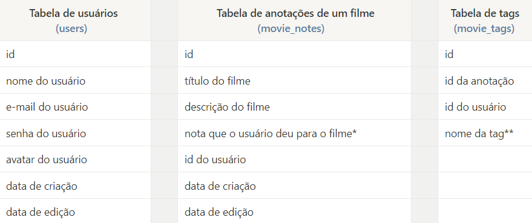

<h1 align="center"> Back-end em Node.js </h1>

Oiêê, terminei mais um módulo do curso Explorer da Rockeseat...

 E nesse módulo aprendi sobre: O que é o Node.js como ele funciona e suas vantagens. Construí uma API completa utilizando Node.js e Express. Utilizei o Insomnia para cadastrar as rotas e verificar os status codes das mesmas. Criei um banco de dados utilizando SQLite, manipulei o DB utilizando a ferramenta Beekeeper Studio juntamente com o Query Builder Knex.js. 

## 🚀 Tecnologias

Esse projeto foi desenvolvido com as seguintes tecnologias:

- Node.js
- Insomnia
- SQLite utilizando a ferramenta Beekeeper Studio
- Query Builder (Knex.js)
- Git e Github

## 💻 Projeto
A ideia foi criar uma aplicação em Node.js onde o usuário cadastra um filme, preenche com algumas informações (nome, descrição, nota) e cria tags relacionadas a ele. 

Alguns detalhes complementares que decidi acrescentar:

- Criptografia de senhas;
- O CASCADE para garantir que uma tag será excluída caso o usuário opte por excluir a nota;
- Validação de e-mail.

Abaixo, utilizei esse diagrama como base:

  

Agora mais detalhado:

  

*Valores inteiros que podem variar de 1 até o 5.
**Exemplos: ação, comedia, terror, medo...etc.

---

Feito com ♥ by Elizandra Monteiro